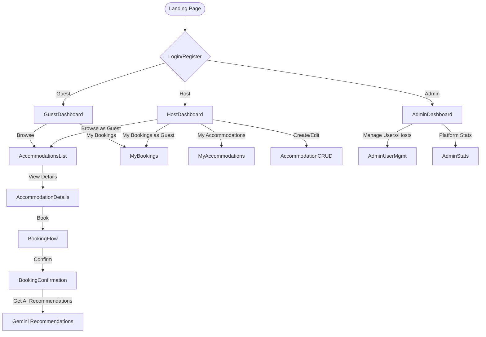
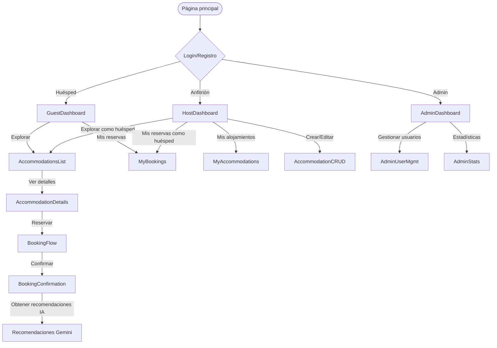

# Dream Driven Bookings – Full-Stack Accommodation Platform with DDD, AI & Admin Panel


---


## 📚 Table of Contents / Tabla de Contenidos

**English**
- [Overview](#overview)
- [Architecture](#folder-structure--ddd-architecture)
- [Tech Stack](#tech-stack)
- [Features](#key-features)
- [AI & Automation 🤖](#ai--automation)
- [App Navigation & User Flow Diagram 🧭](#app-navigation--user-flow-diagram)
- [Getting Started 🚀](#getting-started)
- [Deployment 🌍](#deployment)
- [License 📄](#license)

**Español**
- [Descripción General](#descripción-general)
- [Estructura de Carpetas y Arquitectura DDD](#estructura-de-carpetas-y-arquitectura-ddd)
- [Stack Tecnológico](#stack-tecnológico)
- [Funcionalidades Clave](#funcionalidades-clave)
- [IA y Automatización 🤖](#ia-y-automatización)
- [Diagrama de Navegación y Flujo de Usuario 🧭](#diagrama-de-navegación-y-flujo-de-usuario)
- [Cómo Empezar 🚀](#cómo-empezar)
- [Despliegue 🌍](#despliegue)
- [Licencia 📄](#licencia)

---

## English

### Overview
Dream Driven Bookings is a full-stack accommodation and booking platform built with a strong focus on Domain-Driven Design (DDD), clean architecture, and modern web technologies. It supports guests, hosts, and admins, and features intelligent AI-powered recommendations for users.

---

### Folder Structure & DDD Architecture

```
/UF1845-DDD
├── src/
│   ├── accommodations/
│   │   ├── api/            # Express route handlers/controllers
│   │   ├── application/    # Application services/use cases
│   │   ├── domain/         # Domain models, repositories, business logic
│   │   ├── infrastructure/ # Data access, external APIs (e.g., Gemini)
│   │   ├── models/         # Mongoose schemas
│   │   └── utils/          # Utilities
│   ├── bookings/
│   │   ├── api/
│   │   ├── application/
│   │   ├── domain/
│   │   ├── infrastructure/
│   │   ├── models/
│   │   └── utils/
│   ├── users/
│   │   ├── api/
│   │   ├── application/
│   │   ├── domain/
│   │   ├── infrastructure/
│   │   └── models/
│   ├── payments/            # Not implemented
│   ├── reviews/             # Not implemented
│   ├── auth/                # Authentication logic
│   ├── config/              # DB, cloud, and middleware config
│   ├── shared/              # Shared utilities (e.g., amenity icons)
│   ├── views/               # EJS templates (UI)
│   └── web/                 # Web routes (admin, public)
├── public/                  # Static assets (CSS, images, videos)
├── package.json             # Project metadata and dependencies
└── ...
```

---

### DDD Layers
- `domain/`: Pure business logic, entities, value objects, interfaces.
- `application/`: Use cases, service orchestration.
- `infrastructure/`: Data access (MongoDB), external APIs (Gemini), persistence.
- `api/`: Express route handlers/controllers.
- `models/`: Mongoose schemas for MongoDB.

---

### Tech Stack
- **Backend:** Node.js, Express.js, MongoDB, Mongoose, dotenv, express-session, connect-mongo
- **Frontend:** EJS (server-side rendering), Bootstrap 5, FontAwesome, custom CSS
- **AI/Automation:** Google Gemini API (intelligent filtering, recommendations)
- **File Uploads:** Multer, Cloudinary
- **PDF Generation:** PDFKit
- **Other:** bcrypt, method-override, node-fetch

---

### Key Features
- Modular DDD-based architecture for scalability and maintainability
- User roles: Guest, Host, Admin
- Secure authentication and session management
- Full CRUD (Create, Read, Update, Delete) for accommodations
- Booking flow with date/guest selection, price calculation, and PDF confirmation
- Admin dashboard for platform management
- AI-powered features:
  - Natural language filtering (Gemini)
  - Cultural/Activity recommendations after booking
- Responsive, modern UI with Bootstrap
- Form validation and error handling
- File/image upload for accommodations
- PDF download for booking confirmations

---

### AI & Automation
- **Google Gemini API**:
  1. **Intelligent Filtering**: Filter accommodations using natural language prompts (e.g., "pet-friendly with pool in Cádiz").
  2. **Cultural Recommendations**: Get AI-generated activity suggestions for your travel destination and dates.
- **Prompt Engineering**: Optimized for concise, structured results, with fallback/error handling.

---

### App Navigation & User Flow Diagram


---

### Getting Started

```bash
# 1. Clone the repo
git clone https://github.com/yourusername/dream-driven-bookings.git

# 2. Install dependencies
cd UF1845-DDD
npm install

# 3. Configure environment variables
cp .env.example .env
# Fill in your MongoDB, Cloudinary and Gemini credentials

# 4. (Optional) Seed admin user
node src/seed/admin.js

# 5. Start development server
npm run dev
```

---

### Deployment
- Compatible with Render, Vercel or Docker
- Uses `.env` for secrets
- Static assets in `/public`
- Server-side views via EJS

---

### License
MIT License — see [LICENSE](./LICENSE)

---

### Disclaimer
This is a personal portfolio project. External services may have usage limits or require payment. No production warranties implied.

---

### Contact
Made with ❤️ by [Alejandro Noriega Guerra](https://github.com/alenorgue)

---

## Español

### Descripción General
Dream Driven Bookings es una plataforma full-stack de reservas y alojamientos, construida con enfoque en Domain-Driven Design (DDD), arquitectura limpia y tecnologías web modernas. Soporta huéspedes, anfitriones y administradores, e incluye recomendaciones inteligentes impulsadas por IA.

---

### Estructura de Carpetas y Arquitectura DDD

```
/UF1845-DDD
├── src/
│   ├── accommodations/
│   │   ├── api/            # Controladores y rutas Express
│   │   ├── application/    # Casos de uso y servicios de aplicación
│   │   ├── domain/         # Modelos de dominio, lógica de negocio, interfaces
│   │   ├── infrastructure/ # Acceso a datos, APIs externas (Gemini)
│   │   ├── models/         # Esquemas Mongoose
│   │   └── utils/          # Utilidades
│   ├── bookings/
│   │   ├── api/
│   │   ├── application/
│   │   ├── domain/
│   │   ├── infrastructure/
│   │   ├── models/
│   │   └── utils/
│   ├── users/
│   │   ├── api/
│   │   ├── application/
│   │   ├── domain/
│   │   ├── infrastructure/
│   │   └── models/
│   ├── payments/            # No implementado
│   ├── reviews/             # No implementado
│   ├── auth/                # Lógica de autenticación
│   ├── config/              # Configuración de DB, cloud y middleware
│   ├── shared/              # Utilidades compartidas (iconos, etc.)
│   ├── views/               # Plantillas EJS (UI)
│   └── web/                 # Rutas web (admin, público)
├── public/                  # Recursos estáticos (CSS, imágenes, videos)
├── package.json             # Dependencias y metadatos
└── ...
```

---

### Capas DDD
- `domain/`: Lógica de negocio pura, entidades, objetos de valor, interfaces
- `application/`: Casos de uso, orquestación de servicios
- `infrastructure/`: Persistencia (MongoDB), APIs externas (Gemini)
- `api/`: Controladores y rutas Express
- `models/`: Esquemas Mongoose para MongoDB

---

### Stack Tecnológico
- **Backend:** Node.js, Express.js, MongoDB, Mongoose, dotenv, express-session, connect-mongo
- **Frontend:** EJS (renderizado en servidor), Bootstrap 5, FontAwesome, CSS personalizado
- **IA/Automatización:** Google Gemini API (filtros inteligentes, recomendaciones)
- **Subida de Archivos:** Multer, Cloudinary
- **PDF:** PDFKit
- **Otros:** bcrypt, method-override, node-fetch

---

### Funcionalidades Clave
- Arquitectura modular DDD para escalabilidad y mantenibilidad
- Roles: Huésped, Anfitrión, Admin
- Autenticación segura y gestión de sesión
- CRUD completo para alojamientos
- Flujo de reserva con fechas, cálculo de precio y PDF
- Panel de administración para gestión de la plataforma
- IA integrada:
  - Filtrado inteligente por lenguaje natural (Gemini)
  - Recomendaciones culturales tras reservar
- UI moderna y responsive con Bootstrap
- Validación de formularios y gestión de errores
- Subida de imágenes para alojamientos
- Descarga de PDF de confirmación

---

### IA y Automatización
- **Google Gemini API**:
  1. **Filtrado inteligente**: prompts como "pet-friendly con piscina en Cádiz"
  2. **Recomendaciones culturales**: actividades según ciudad y fechas de viaje
- **Ingeniería de prompts**: Respuestas estructuradas, con fallback ante errores

---

### Diagrama de Navegación y Flujo de Usuario


---

### Cómo Empezar

```bash
# 1. Clonar el repositorio
git clone https://github.com/yourusername/dream-driven-bookings.git

# 2. Instalar dependencias
cd UF1845-DDD
npm install

# 3. Configurar variables de entorno
cp .env.example .env
# Añadir MongoDB, Cloudinary y Gemini keys

# 4. (Opcional) Crear usuario admin
node src/seed/admin.js

# 5. Iniciar servidor de desarrollo
npm run dev
```

---

### Despliegue
- Compatible con Render, Vercel o Docker
- Usa `.env` para credenciales
- Recursos estáticos en `/public`
- Plantillas en EJS

---

### Licencia
Licencia MIT — ver archivo [LICENSE](./LICENSE)

---

### Aviso Legal
Proyecto educativo/personal. Los servicios externos pueden tener límites o requerir suscripciones.

---

### Contacto
Hecho con ❤️ por [Alejandro Noriega Guerra](https://github.com/alenorgue)
