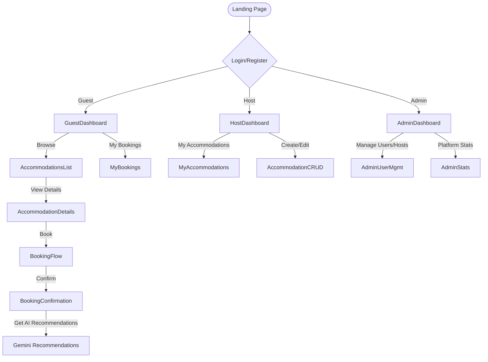
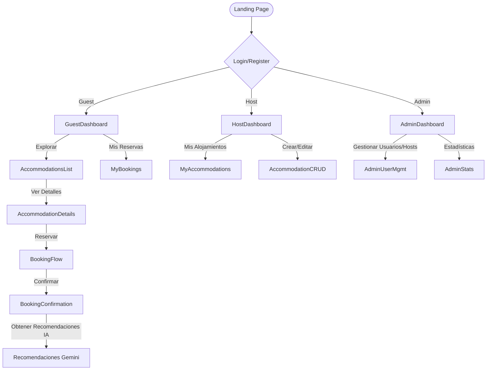

# Dream Driven Bookings (DDBookings)

---

## English

### Overview
Dream Driven Bookings is a full-stack accommodation and booking platform built with a strong focus on Domain-Driven Design (DDD), clean architecture, and modern web technologies. It supports guests, hosts, and admins, and features intelligent AI-powered recommendations for users.

---

### Folder Structure & DDD Architecture

```
/UF1845-DDD
├── src/
│   ├── accommodations/
│   │   ├── api/            # Express route handlers/controllers
│   │   ├── application/    # Application services/use cases
│   │   ├── domain/         # Domain models, repositories, business logic
│   │   ├── infrastructure/ # Data access, external APIs (e.g., Gemini)
│   │   ├── models/         # Mongoose schemas
│   │   └── utils/          # Utilities
│   ├── bookings/
│   │   ├── api/
│   │   ├── application/
│   │   ├── domain/
│   │   ├── infrastructure/
│   │   ├── models/
│   │   └── utils/
│   ├── users/
│   │   ├── api/
│   │   ├── application/
│   │   ├── domain/
│   │   ├── infrastructure/
│   │   └── models/
│   ├── auth/                # Authentication logic
│   ├── config/              # DB, cloud, and middleware config
│   ├── shared/              # Shared utilities (e.g., amenity icons)
│   ├── views/               # EJS templates (UI)
│   └── web/                 # Web routes (admin, public)
├── public/                  # Static assets (CSS, images, videos)
├── package.json             # Project metadata and dependencies
└── ...
```

- **DDD Layers:**
  - `domain/`: Pure business logic, entities, value objects, interfaces.
  - `application/`: Use cases, service orchestration.
  - `infrastructure/`: Data access (MongoDB), external APIs (Gemini), persistence.
  - `api/`: Express route handlers/controllers.
  - `models/`: Mongoose schemas for MongoDB.

---

### Data Models & DDD Layers
- **User**: Defined in `users/domain/User.js` and `users/models/UserModel.js`. Includes roles (guest, host, admin), authentication, and profile data.
- **Accommodation**: In `accommodations/domain/Accommodation.js` and `accommodations/models/AccommodationModel.js`. Contains details, amenities, location, pricing, and host reference.
- **Booking**: In `bookings/domain/Booking.js` and `bookings/models/BookingModel.js`. Tracks guest, accommodation, dates, status, and payment info.
- **Repositories**: Each domain has repository interfaces and MongoDB implementations in `infrastructure/`.

---

### Tech Stack
- **Backend:** Node.js, Express.js, MongoDB, Mongoose, dotenv, express-session, connect-mongo
- **Frontend:** EJS (server-side rendering), Bootstrap 5, FontAwesome, custom CSS
- **AI/Automation:** Google Gemini API (intelligent filtering, recommendations)
- **File Uploads:** Multer, Cloudinary
- **PDF Generation:** PDFKit
- **Other:** bcrypt, method-override, node-fetch

---

### Key Features
- DDD-based modular architecture for scalability and maintainability
- User roles: Guest, Host, Admin
- Secure authentication and session management
- Accommodation CRUD (create, update, delete, list, details)
- Booking flow with date/guest selection, price calculation, and PDF confirmation
- Admin dashboard for platform management
- AI-powered features:
  - Intelligent accommodation filtering (Gemini)
  - Activity/cultural recommendations after booking (Gemini)
- Responsive, modern UI with Bootstrap
- Form validation and error handling
- File/image upload for accommodations
- PDF download for booking confirmations

---

### AI & Automation
- **Google Gemini API**: Used for two main features:
  1. **Intelligent Filtering**: Users can enter natural language prompts to filter accommodations (e.g., "pet-friendly with pool in Cádiz").
  2. **Cultural Recommendations**: After booking, users can request AI-generated suggestions for activities or places to visit in their destination city and dates.
- **Prompt Engineering**: Prompts are optimized for concise, structured responses, with robust error handling and fallbacks.

---

### App Navigation & User Flow Diagram

- **Guest**: Browse, book, get AI recs, manage bookings
- **Host**: Manage own accommodations, see bookings
- **Admin**: Manage users, hosts, platform data

---

### Security, Deployment, Testing, Scalability, UX
- **Security**: Passwords hashed (bcrypt), sessions stored in MongoDB, input validation, role-based access
- **Deployment**: Ready for cloud (uses dotenv, cloudinary, MongoDB Atlas), static assets in `/public`
- **Testing**: Modular DDD structure enables easy unit/integration testing (test stubs provided)
- **Scalability**: DDD and repository pattern allow for easy extension (e.g., new domains, microservices)
- **User Experience**: Responsive design, clear error messages, modern UI, PDF confirmations, AI features for delight

---

## Español

### Descripción General
Dream Driven Bookings es una plataforma full-stack de reservas y alojamientos, construida con enfoque en Domain-Driven Design (DDD), arquitectura limpia y tecnologías web modernas. Soporta huéspedes, anfitriones y administradores, e incluye recomendaciones inteligentes impulsadas por IA.

---

### Estructura de Carpetas y Arquitectura DDD

```
/UF1845-DDD
├── src/
│   ├── accommodations/
│   │   ├── api/            # Controladores y rutas Express
│   │   ├── application/    # Casos de uso y servicios de aplicación
│   │   ├── domain/         # Modelos de dominio, lógica de negocio, interfaces
│   │   ├── infrastructure/ # Acceso a datos, APIs externas (Gemini)
│   │   ├── models/         # Esquemas Mongoose
│   │   └── utils/          # Utilidades
│   ├── bookings/
│   │   ├── api/
│   │   ├── application/
│   │   ├── domain/
│   │   ├── infrastructure/
│   │   ├── models/
│   │   └── utils/
│   ├── users/
│   │   ├── api/
│   │   ├── application/
│   │   ├── domain/
│   │   ├── infrastructure/
│   │   └── models/
│   ├── auth/                # Lógica de autenticación
│   ├── config/              # Configuración de DB, cloud y middleware
│   ├── shared/              # Utilidades compartidas (iconos, etc.)
│   ├── views/               # Plantillas EJS (UI)
│   └── web/                 # Rutas web (admin, público)
├── public/                  # Recursos estáticos (CSS, imágenes, videos)
├── package.json             # Dependencias y metadatos
└── ...
```

- **Capas DDD:**
  - `domain/`: Lógica de negocio pura, entidades, objetos de valor, interfaces
  - `application/`: Casos de uso, orquestación de servicios
  - `infrastructure/`: Persistencia (MongoDB), APIs externas (Gemini)
  - `api/`: Controladores y rutas Express
  - `models/`: Esquemas Mongoose para MongoDB

---

### Modelos de Datos y Capas DDD
- **Usuario**: Definido en `users/domain/User.js` y `users/models/UserModel.js`. Incluye roles (huésped, anfitrión, admin), autenticación y perfil.
- **Alojamiento**: En `accommodations/domain/Accommodation.js` y `accommodations/models/AccommodationModel.js`. Detalles, amenities, localización, precio, referencia de anfitrión.
- **Reserva**: En `bookings/domain/Booking.js` y `bookings/models/BookingModel.js`. Huésped, alojamiento, fechas, estado, pago.
- **Repositorios**: Cada dominio tiene interfaces y una implementación MongoDB en `infrastructure/`.

---

### Stack Tecnológico
- **Backend:** Node.js, Express.js, MongoDB, Mongoose, dotenv, express-session, connect-mongo
- **Frontend:** EJS (renderizado en servidor), Bootstrap 5, FontAwesome, CSS personalizado
- **IA/Automatización:** Google Gemini API (filtros inteligentes, recomendaciones)
- **Subida de Archivos:** Multer, Cloudinary
- **PDF:** PDFKit
- **Otros:** bcrypt, method-override, node-fetch

---

### Funcionalidades Clave
- Arquitectura modular DDD para escalabilidad y mantenibilidad
- Roles: Huésped, Anfitrión, Admin
- Autenticación segura y gestión de sesión
- CRUD de alojamientos (crear, editar, eliminar, listar, detalles)
- Flujo de reserva con selección de fechas/huéspedes, cálculo de precio y PDF
- Panel de administración para gestión de la plataforma
- Funcionalidades IA:
  - Filtro inteligente de alojamientos (Gemini)
  - Recomendaciones culturales/actividades tras reservar (Gemini)
- UI moderna y responsive con Bootstrap
- Validación de formularios y manejo de errores
- Subida de imágenes para alojamientos
- Descarga de PDF de confirmación de reserva

---

### IA y Automatización
- **Google Gemini API**: Usada para dos funciones principales:
  1. **Filtrado inteligente**: El usuario puede filtrar alojamientos con prompts en lenguaje natural (ej: "pet-friendly con piscina en Cádiz").
  2. **Recomendaciones culturales**: Tras reservar, el usuario puede pedir sugerencias IA de actividades o lugares para su destino y fechas.
- **Ingeniería de prompts**: Prompts optimizados para respuestas estructuradas, con manejo robusto de errores y fallback.

---

### Diagrama de Navegación y Flujo de Usuario

- **Huésped**: Explora, reserva, IA, gestiona reservas
- **Anfitrión**: Gestiona alojamientos, ve reservas
- **Admin**: Gestiona usuarios, anfitriones, datos

---

### Seguridad, Despliegue, Testing, Escalabilidad, UX
- **Seguridad**: Contraseñas hasheadas (bcrypt), sesiones en MongoDB, validación de inputs, control de roles
- **Despliegue**: Listo para cloud (dotenv, cloudinary, MongoDB Atlas), estáticos en `/public`
- **Testing**: Estructura DDD facilita tests unitarios/integración (stubs incluidos)
- **Escalabilidad**: DDD y repositorios permiten fácil extensión (nuevos dominios, microservicios)
- **Experiencia de usuario**: Responsive, mensajes claros, UI moderna, PDF, IA para sorprender

---

